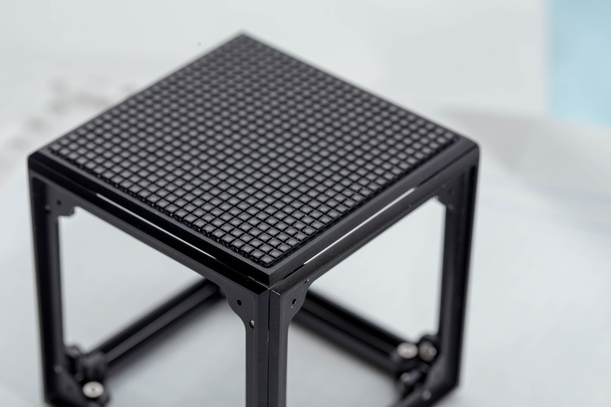
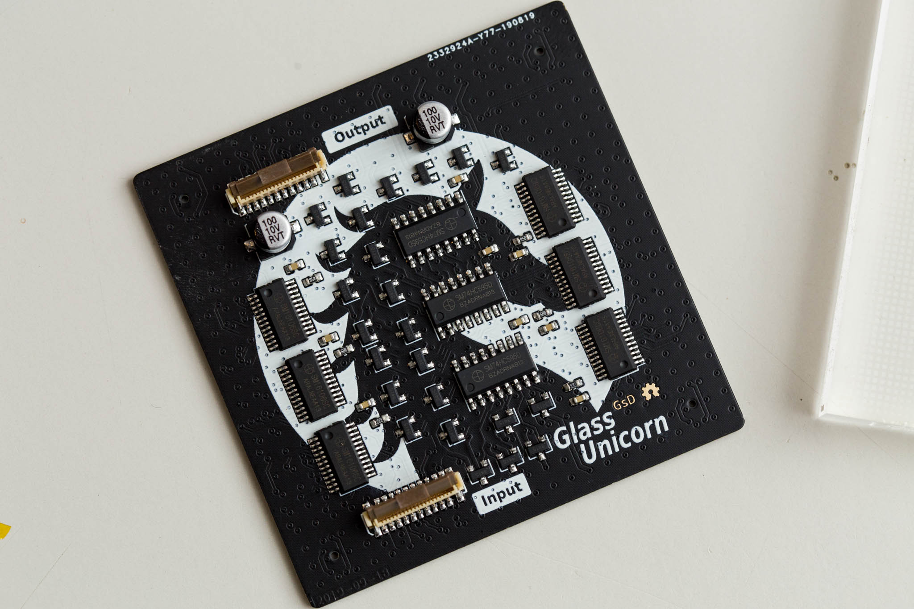
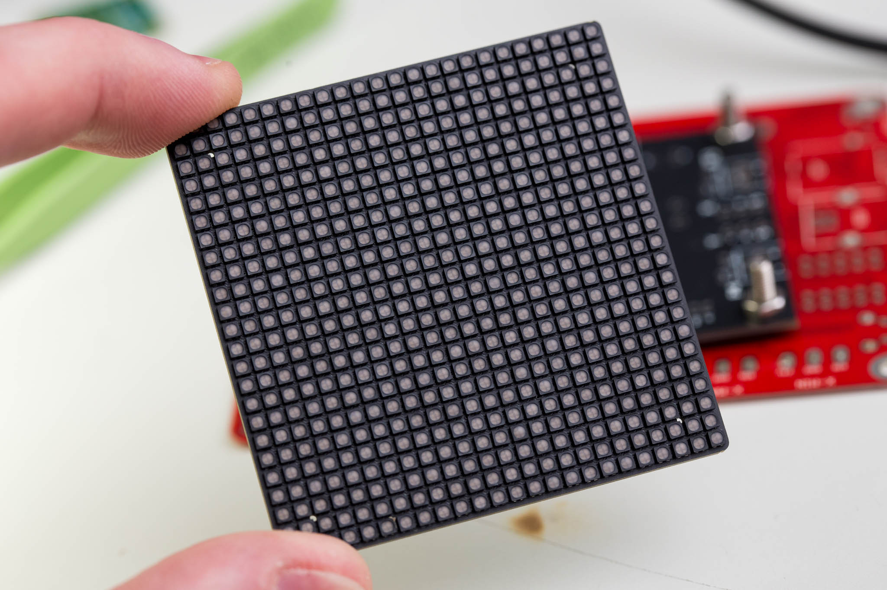
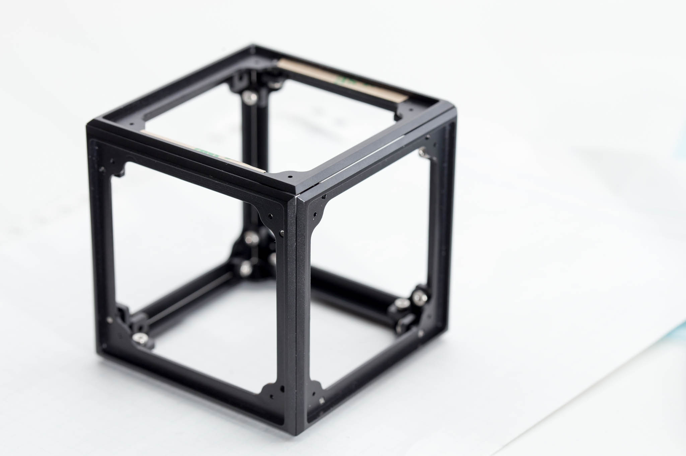
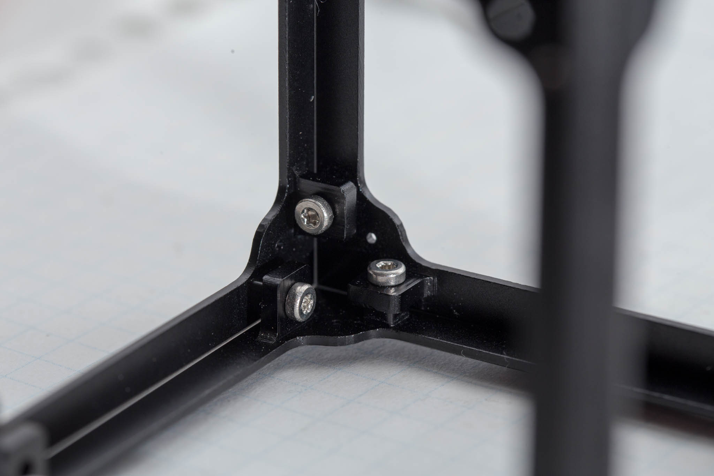

# Glass Unicorn

## Colection of various dense LED matrix projects

	Project status: Work in progress

## Panel_r0.1
 * 24x24 RGB 2020 LEDs
 * Matrix construction with 4bit wide serial input.
 * Optimised for low cost: ~$15 BOM cost

## Cube_r0.1
 * Aluminium frame to fit the panels in a cube
 * ~64mm square

## Controller_r0.1

    TBD