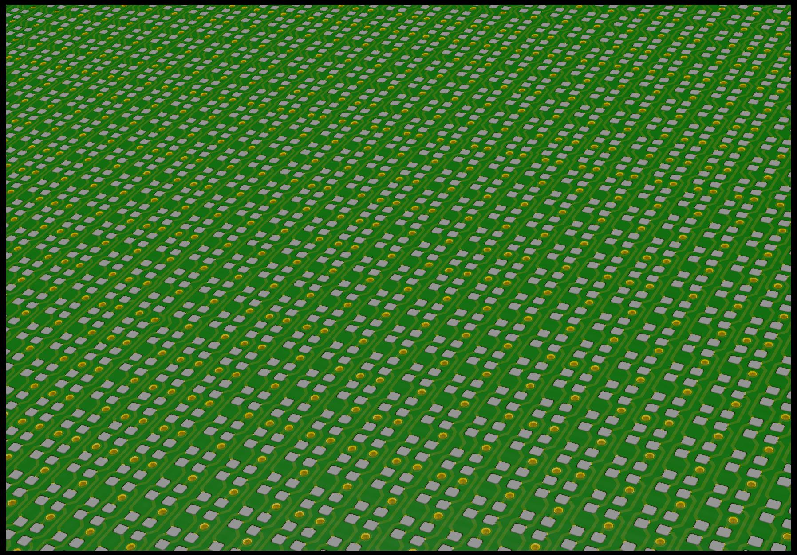
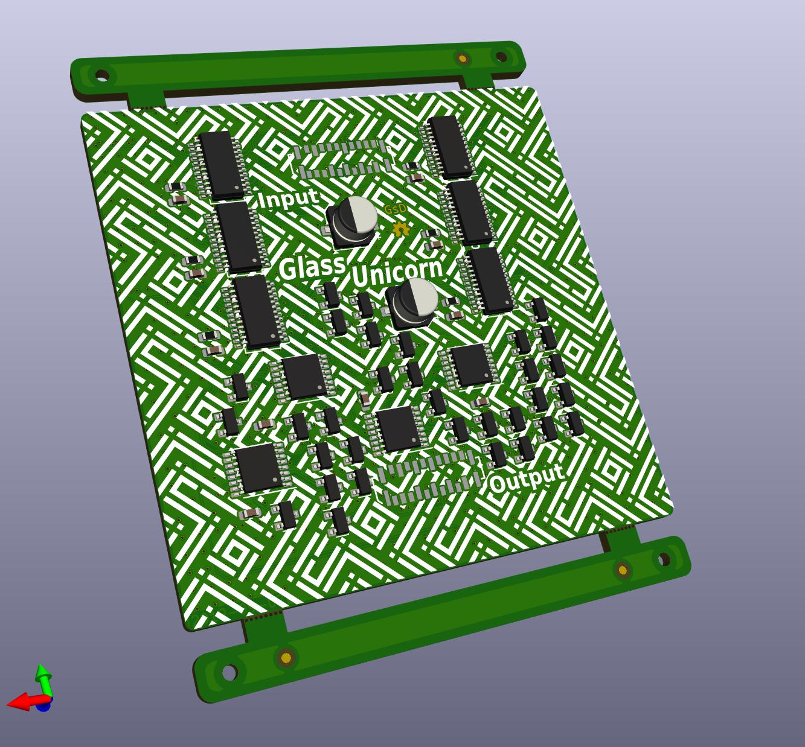
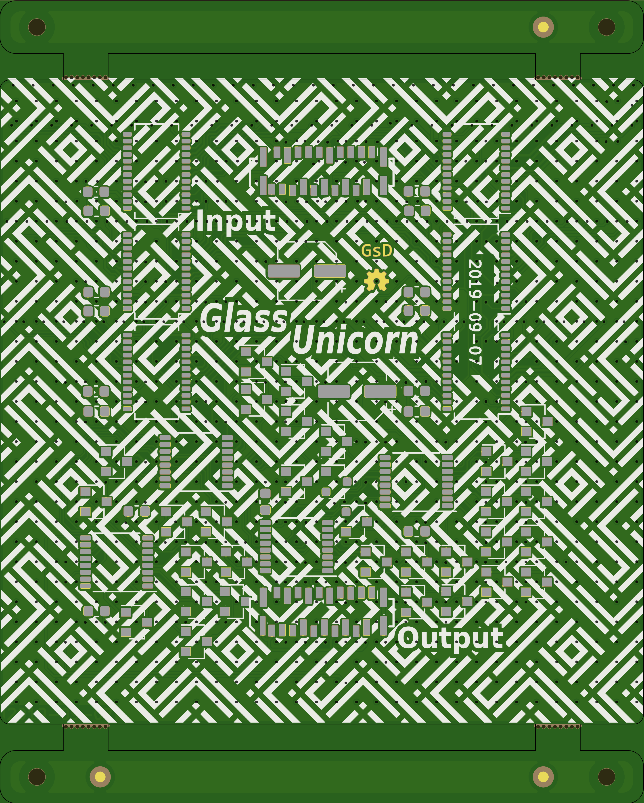
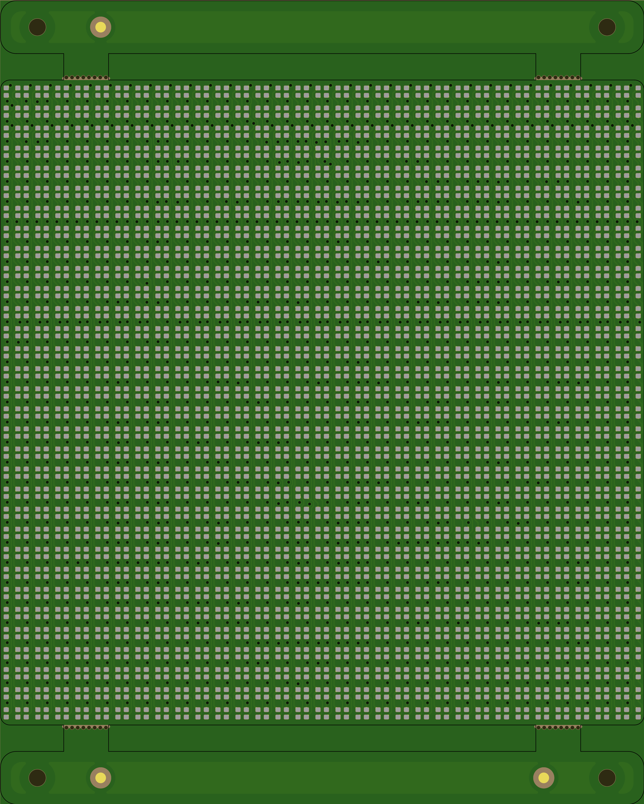

# Panel_32x32_1515_P1.8

## Custom RGB LED panel

	Project status: Boards ordered

## Features
 * 32x32 RGB 1515 LEDs
 * Approximatey 1.8mm pixel pitch
 * Matrix construction with 4bit wide serial input.
 * BCM required for colour depth

